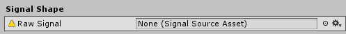
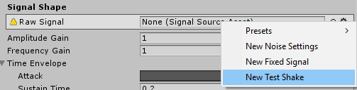

Randomizing Camera Shake Using Cinemachine
==========================================

The new impulses module is pretty cool. You can generate shake patterns using
Scriptable Object assets and plug them into Cinemachine Impulse Source
components. This is pretty cool.

**But what if you want to randomize the shake?**

A friend of mine quickly pointed out this apparent noise, as he wanted a
different shake every time a camera shake event was fired. His solution involved
creating a new game object for the Cinemachine virtual camera to target and
shaking that.

**I didn’t like that solution.**

### Investigating Alternatives

The field we are interested in is on one of the Cinemachine Impulse Source
variants:



Notice how it asks for a Signal Source Asset? Yet if you click the gear, you
will find you have several different options for types of Assets you can create.

What’s going on here?

### Unity API to the Rescue!

It turns out that Signal Source Asset is an `abstract` type of`
ScriptableObject`. That’s convenient! So all we need to do is subclass
`SignalSourceAsset` and override the abstract methods. Here’s a template:

```csharp
using System.Collections;
using System.Collections.Generic;
using Cinemachine;
using UnityEngine;

[CreateAssetMenu(fileName = "TestShake", menuName = "TestShakeAsset")]
public class TestShake : SignalSourceAsset
{
    public override float SignalDuration
    {
        get
        {
            return 1000000f;
        }
    }

    public override void GetSignal(float timeSinceSignalStart, out Vector3 pos, out Quaternion rot)
    {
        pos = Vector3.zero;
        rot = Quaternion.identity;
    }
}
```

You’ll want to set the `SignalDuration` to return how long the impulse should
play. `GetSignal` is where the magic happens. That’s where you will want to call
your random number generator of choice or generate other noise patterns. Don’t
forget that because this is a `ScriptableObject`, you can add your own public
fields to be customizable in the inspector.

### A Nice Little Surprise

This just worked:


